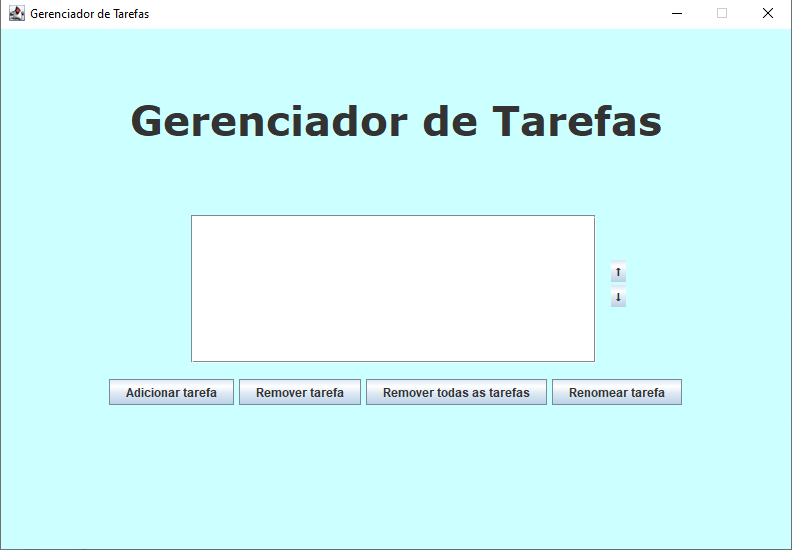
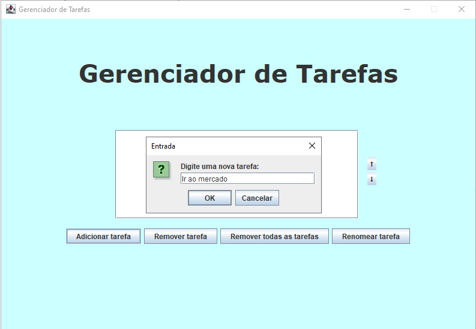
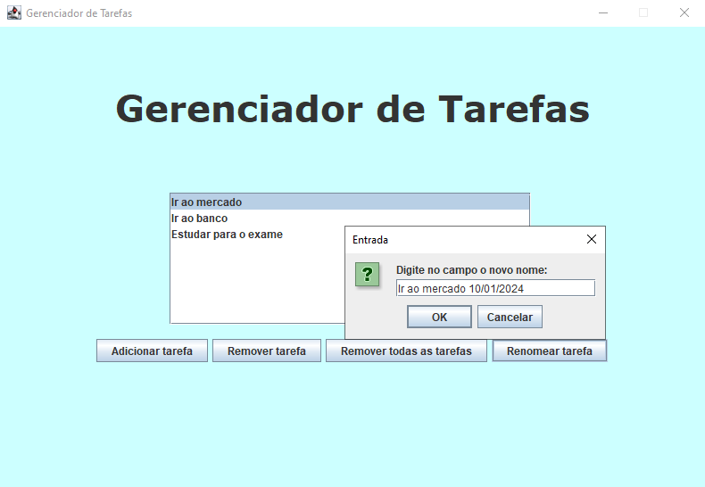
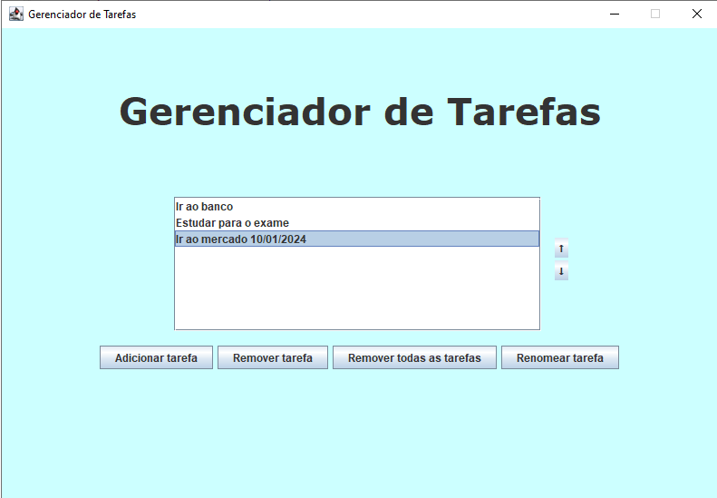

<h1 align="center"> Gerenciador de Tarefas </h1>

Interface gráfica desenvolvida usando Java e a biblioteca Swing.

  <a href="#-tecnologias">Tecnologias</a>&nbsp;&nbsp;&nbsp;|&nbsp;&nbsp;&nbsp;
  <a href="#-projeto">Projeto</a>&nbsp;&nbsp;&nbsp;

 

  
  
  
  

## 🚀 Tecnologias

Esse projeto foi desenvolvido com as seguintes tecnologias:

- Java
- AWT e Swing

## 💻 Projeto

Lista de tarefas desenvolvida com Java e Swing.  
É possível adicionar uma nova tarefa, renomear as tarefas definidas, excluir a tarefa selecionada, excluir todas as tarefas na tela e inclusive modificar a posição das tarefas na lista utilizando as setas no canto direito.
